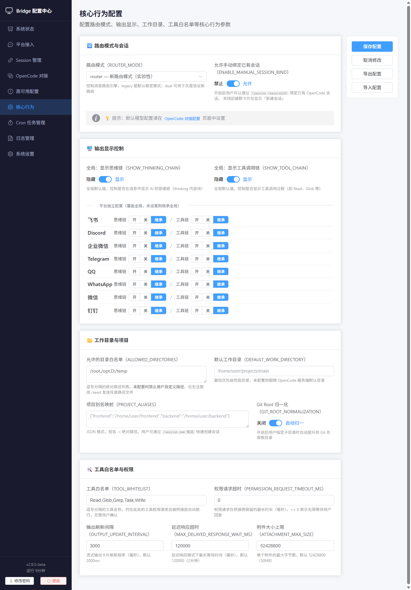

# OpenCode Bridge v2.9.5-beta

[]()
[](https://nodejs.org/)
[](https://www.typescriptlang.org/)
[](https://www.gnu.org/licenses/gpl-3.0)

**[中文](README.md)** | **[English](README-en.md)**

---

**Feishu / Discord / WeCom × OpenCode Multi-Platform Bridge Service**

Through "platform adapter layer + root router + OpenCode event hub + domain processors", focusing on cross-platform scalability, permission loop stability, directory instance consistency, and production maintainability.

**v2.9.5-beta New Feature: Web Visual Configuration Center** - Configuration parameters migrated from `.env` to SQLite database, supporting real-time configuration modification, Cron task management, and service status viewing through browser, no need to manually edit configuration files.

## 📋 Table of Contents

- [Why Use This](#why-use-this)
- [Capabilities Overview](#capabilities-overview)
- [Demo](#demo)
- [Architecture](#architecture)
- [Quick Start](#quick-start)
- [Deployment & Ops](#deployment--ops)
- [Configuration Center](#configuration-center)
- [Reliability Features](#reliability-features)
- [Platform Configuration](#platform-configuration)
- [Commands](#commands)
- [Agent Usage](#agent-usage)
- [Detailed Documentation](#detailed-documentation)

<a id="why-use-this"></a>
## 💡 Why Use This

- **Multi-platform Support**: One service supports Feishu, Discord, and WeCom simultaneously with unified routing and permission management
- **User-friendly**: Permission confirmation, question answering, and session operations all happen within chat platforms, without relying on local terminals
- **Collaboration-friendly**: Supports binding existing sessions and migration binding, maintaining context across devices and groups
- **Stability-friendly**: Session mapping persistence + dual-end undo + consistent cleanup rules avoid "looks normal but state is misaligned"
- **Ops-friendly**: Built-in deployment, upgrade, status checks, and background management workflows suitable for continuous hosted operation
- **Monitoring-friendly**: Built-in Cron scheduled tasks and proactive heartbeat, providing complete reliability guarantees
- **Configuration-friendly**: Web visual configuration center, real-time configuration modification without service restart (except some sensitive configurations)
- **Future-version friendly**: Compatible with OpenCode Server Basic Auth, ready for mandatory password enforcement

<a id="capabilities-overview"></a>
## 📸 Capabilities Overview

| Capability | What You Get | Related Commands/Config |
|---|---|---|
| **Multi-platform Unified Routing** | Feishu, Discord, WeCom unified entry, routed to correct session | Platform bot messages |
| **Unified Group/Private Routing** | Single entry point for private and group chat, routed to correct session | Group @bot; private direct message |
| **Private Chat Session Selection** | Choose "new session / bind existing" when creating chat | `/create_chat`, `/create-group` |
| **Manual Session Binding** | Directly connect specified session to current group without interrupting context | `/session <sessionId>`, `ENABLE_MANUAL_SESSION_BIND` |
| **Migration Binding & Delete Protection** | Auto-migrate old group mappings and protect sessions from accidental deletion | Auto-enabled (manual binding scenarios) |
| **Lifecycle Cleanup Fallback** | Startup cleanup and manual cleanup share same rules, reducing accidental cleanup | `/clear free session` |
| **Permission Card Loop** | OpenCode permission requests confirmed within chat platform with result callback | `permission.asked` |
| **Question Card Loop** | OpenCode questions answered/skipped within chat platform to continue tasks | `question.asked` |
| **Stream Multi-card Overflow Protection** | Auto-paginate when exceeding component budget, continuous old page updates | Stream card pagination (budget 180) |
| **Dual-end Undo Consistency** | Undo rolls back both platform messages and OpenCode session state | `/undo` |
| **Model/Role/Intensity Visual Control** | Switch model, role, reasoning intensity per session with panel view and commands | `/panel`, `/model`, `/agent`, `/effort` |
| **Context Compression** | Trigger session summarize within chat platform to free context window | `/compact` |
| **Shell Command Passthrough** | Whitelisted `!` commands execute via OpenCode shell with echoed output | `!ls`, `!pwd`, `!git status` |
| **Server Auth Compatible** | Supports OpenCode Server Basic Auth, ready for mandatory password default | `OPENCODE_SERVER_USERNAME`, `OPENCODE_SERVER_PASSWORD` |
| **File Send to Platform** | AI can send files/screenshots from computer directly to current group chat | `/send`, `send-file` |
| **Working Directory/Project Management** | Specify working directory when creating session, with project aliases, group defaults, 9-stage security validation | `/project list`, `/session new <alias>`, `ALLOWED_DIRECTORIES` |
| **Runtime Cron Management** | Runtime Cron (API/command/natural language) for managing scheduled tasks | HTTP API, `/cron`, `///cron` |
| **Auto-rescue System** | Local crash auto-rescue (with config backup/2-level fallback) + optional proactive heartbeat | `RELIABILITY_*` config |
| **Web Visual Configuration Center** | Browser-accessible configuration panel for real-time parameter modification, Cron task management, service status viewing | `ADMIN_PORT`, `ADMIN_PASSWORD`, access `http://host:4098` |
| **Deployment/ops Closure** | Integrated entry point for deploy/upgrade/check/background/systemd | `scripts/deploy.*`, `scripts/start.*` |

<a id="demo"></a>
## 🖼️ Demo

<details>
<summary>Step 1: Web Visual Interface (Click to expand)</summary>

<p>
  
  
  
  
  
  
  
  
</p>

</details>

<details>
<summary>Step 2: Private Chat Independent Session (Click to expand)</summary>

<p>
  
  
  
  
</p>

</details>

<details>
<summary>Step 3: Multi-Group Independent Sessions (Click to expand)</summary>

<p>
  
  
  
</p>

</details>

<details>
<summary>Step 4: Image Attachment Parsing (Click to expand)</summary>

<p>
  
  
  
</p>

</details>

<details>
<summary>Step 5: Interactive Tool Testing (Click to expand)</summary>

<p>
  
  
</p>

</details>

<details>
<summary>Step 6: Permission System Testing (Click to expand)</summary>

<p>
  
  
  
  
</p>

</details>

<details>
<summary>Step 7: Session Cleanup (Click to expand)</summary>

<p>
  
  
  
</p>

</details>

<a id="architecture"></a>
## 📌 Architecture

See [Architecture Document](assets/docs/architecture-en.md).

Core layers:
- **Platform Adapter Layer**: Feishu Adapter / Discord Adapter / WeCom Adapter
- **Entry & Routing Layer**: RootRouter / Platform Handlers
- **Domain Service Layer**: PermissionHandler / QuestionHandler / OutputBuffer / ChatSessionStore
- **OpenCode Integration Layer**: OpencodeClientWrapper / OpenCodeEventHub
- **Reliability Layer**: CronScheduler / RuntimeCronManager / RescueOrchestrator
- **Management Layer**: AdminServer / BridgeManager

<a id="quick-start"></a>
## 🚀 Quick Start

### 1) Run this command first (recommended)

Linux/macOS:

```bash
git clone https://github.com/HNGM-HP/opencode-bridge.git
cd opencode-bridge
chmod +x ./scripts/deploy.sh
./scripts/deploy.sh guide
```

Windows PowerShell:

```powershell
git clone https://github.com/HNGM-HP/opencode-bridge.git
cd opencode-bridge
.\scripts\deploy.ps1 guide
```

This command automatically:
- Detects Node.js / npm (provides installation guide if missing)
- Detects OpenCode installation and port status
- Can install OpenCode with one click (`npm i -g opencode-ai`)
- Installs project dependencies and compiles the bridge service
- If `.env` doesn't exist, automatically generates configuration file with `ADMIN_PORT` and `ADMIN_PASSWORD`

**Note**:
- Running without `guide` suffix opens the menu.
- This command completes "deployment and environment preparation".
- After starting the service, access `http://localhost:4098` in browser to enter the visual configuration panel.

### 2) Web Configuration Panel

After the service starts, open browser and visit:
```
http://localhost:4098
```

Complete in the Web configuration panel:
- Feishu application configuration (`FEISHU_APP_ID`, `FEISHU_APP_SECRET`)
- Discord adapter configuration (`DISCORD_TOKEN`)
- WeCom adapter configuration (`WECOM_BOT_ID`, `WECOM_SECRET`)
- OpenCode connection configuration
- Reliability parameter configuration
- Cron task management
- Service status viewing

**First Access**: The password is in the `ADMIN_PASSWORD` field of `.env` file, a random password is automatically generated on first startup.

### 3) Start OpenCode (keep CLI interface)

```bash
opencode
```

### 4) Start the bridge service

Linux/macOS:

```bash
./scripts/start.sh
```

Windows PowerShell:

```powershell
.\scripts\start.ps1
```

For development debugging:

```bash
npm run dev
```

After startup, visit `http://localhost:4098` to access the Web configuration panel.

### 5) npm CLI installation (better for local continuous running scenarios)

```bash
npm install -g opencode-bridge
opencode-bridge
```

Detailed configuration see [Deployment & Ops Document](assets/docs/deployment-en.md).

<a id="deployment--ops"></a>
## 💻 Deployment & Ops

### Available commands after Node.js installed

| Goal | Command | Description |
|---|---|---|
| One-click deploy | `node scripts/deploy.mjs deploy` | Clean install by default, then install dependencies and compile |
| Start background | `npm run start` | Start in background (auto-detect/supplement build) |
| Stop background | `node scripts/stop.mjs` | Stop background process by PID |
| First-time guide | `node scripts/deploy.mjs guide` | Integrated flow for install/deploy/guide-start |
| Management menu | `npm run manage:bridge` | Interactive menu (default entry point) |

Detailed deployment instructions see [Deployment & Ops Document](assets/docs/deployment-en.md).

<a id="configuration-center"></a>
## ⚙️ Configuration Center

### Web Configuration Panel (Recommended)

After service startup, visit `http://localhost:4098` visual configuration panel:

- **Real-time Configuration**: Parameters take effect immediately after modification (some sensitive configurations require restart)
- **Cron Management**: Create, enable/disable, delete scheduled tasks
- **Service Status**: View uptime, version, database path, etc.
- **Model List**: Get available model list from OpenCode
- **Platform Management**: View platform connection status

### .env File (Startup Parameters Only)

The `.env` file now only stores Admin panel startup parameters:

| Variable | Required | Default | Description |
|---|---|---|---|
| `ADMIN_PORT` | No | `4098` | Web configuration panel listen port |
| `ADMIN_PASSWORD` | No | Auto-generated | Web configuration panel access password |

**Note**: `.env` is no longer used as business configuration file; business configurations are stored in SQLite database.

### Core Business Configuration

The following configurations are managed through Web panel or SQLite database:

| Variable | Required | Default | Description |
|---|---|---|---|
| `Feishu App ID` | No | - | WEB-Platform Access-Feishu (Lark) Config |
| `Feishu App Secret` | No | - | WEB-Platform Access-Feishu (Lark) Config |
| `Enable Discord Adapter` | No | `false` | WEB-Platform Access-Discord Config |
| `Discord Bot Token` | No | - | WEB-Platform Access-Discord Config |
| `Enable WeCom Adapter` | No | `false` | WEB-Platform Access-WeCom Config |
| `WeCom Bot ID` | No | - | WEB-Platform Access-WeCom Config |
| `WeCom Secret` | No | - | WEB-Platform Access-WeCom Config |

Full configuration see [Configuration Center Document](assets/docs/environment-en.md).

### Configuration Storage Notes

**Configuration Migration**: On first startup, the system automatically migrates business configurations from `.env` to SQLite database (`data/config.db`), original `.env` is backed up to `.env.backup`.
- New users can directly open web after deployment

**Sensitive Configuration Restart**: The following configuration changes require service restart to take effect:
- Feishu configuration (`FEISHU_APP_ID`, `FEISHU_APP_SECRET`)
- Discord configuration (`DISCORD_ENABLED`, `DISCORD_TOKEN`)
- WeCom configuration (`WECOM_ENABLED`, `WECOM_BOT_ID`, `WECOM_SECRET`)
- OpenCode connection configuration (`OPENCODE_HOST`, `OPENCODE_PORT`)
- Reliability switches (`RELIABILITY_CRON_ENABLED`, etc.)

<a id="reliability-features"></a>
## 🛡️ Reliability Features (Heartbeat + Cron + Crash Rescue)

See [Reliability Guide](assets/docs/reliability-en.md).

### Quick Overview

- **Built-in Cron tasks**: `watchdog-probe` (30s), `process-consistency-check` (60s), `budget-reset` (daily 0:00)
- **Three management entry points**: HTTP API (`/cron/*`), Feishu (`/cron ...`), Discord (`///cron ...`)
- **Proactive heartbeat**: Configurable timer sends check prompts to Agent Session
- **Auto-rescue**: Auto-repair local OpenCode after consecutive failures reach threshold (loopback only)
- **Runtime Cron**: Support dynamic creation and management of scheduled tasks through API, commands, or natural language

<a id="platform-configuration"></a>
## ⚙️ Platform Configuration

### Feishu Configuration

See [Feishu Configuration Document](assets/docs/feishu-config-en.md).

#### Event Subscriptions

| Event | Required | Purpose |
|---|---|---|
| `im.message.receive_v1` | Yes | Receive group/private messages |
| `im.message.recalled_v1` | Yes | User undo triggers `/undo` rollback |
| `im.chat.member.user.deleted_v1` | Yes | Member leaves group, triggers lifecycle cleanup |
| `im.chat.disbanded_v1` | Yes | Group disbanded, cleanup local session mappings |
| `card.action.trigger` | Yes | Handle control panel, permission confirmation, question card callbacks |

#### Application Permissions

Batch import permissions (save to `acc.json` then import in developer backend):

```json
{
  "scopes": {
    "tenant": [
      "im:message.p2p_msg:readonly",
      "im:chat",
      "im:chat.members:read",
      "im:chat.members:write_only",
      "im:message",
      "im:message.group_at_msg:readonly",
      "im:message.group_msg",
      "im:message.reactions:read",
      "im:message.reactions:write_only",
      "im:resource"
    ],
    "user": []
  }
}
```

### Discord Configuration

See [Discord Configuration Document](assets/docs/discord-config-en.md).

### WeCom Configuration

See [WeCom Configuration Document](assets/docs/wecom-config-en.md).

<a id="commands"></a>
## 📖 Commands

See [Commands Document](assets/docs/commands-en.md).

### Feishu Commands

| Command | Description |
|---|---|
| `/help` | View help |
| `/panel` | Open control panel |
| `/model <provider:model>` | Switch model |
| `/agent <name>` | Switch Agent |
| `/session new` | Start new topic |
| `/undo` | Undo last interaction |
| `/compact` | Compress context |
| `!<shell command>` | Pass through shell command |
| `/commands` | Generate and send the latest command list file |
| `//<command>` | Pass through a namespaced slash command (for example `//superpowers:brainstorming`) |
| `/cron ...` | Manage runtime Cron tasks |

### Discord Commands

| Command | Description |
|---|---|
| `///session` | View bound session |
| `///new` | Create and bind new session |
| `///bind <sessionId>` | Bind existing session |
| `///undo` | Undo last |
| `///compact` | Compress context |
| `///cron ...` | Manage runtime Cron tasks |

### WeCom Commands

| Command | Description |
|---|---|
| `/help` | View help |
| `/panel` | Open control panel |
| `/model <provider:model>` | Switch model |
| `/agent <name>` | Switch Agent |
| `/session new` | Start new topic |
| `/undo` | Undo last interaction |
| `/compact` | Compress context |

<a id="agent-usage"></a>
## 🤖 Agent (Role) Usage

See [Agent Guide](assets/docs/agent-en.md).

### Quick Start

- View current Agent: `/agent`
- Switch Agent: `/agent <name>`
- Return to default: `/agent off`

### Custom Agent

```text
Create Role name=Travel Assistant; description=Expert at travel planning; type=primary; tools=webfetch
```

<a id="key-implementation-details"></a>
## 📌 Key Implementation Details

See [Implementation Document](assets/docs/implementation-en.md).

- Permission request callback: `response` is `once | always | reject`
- Question tool interaction: answers parsed from user text replies
- Stream and thinking cards: text and thinking written to output buffer separately
- `/undo` consistency: delete platform message and execute `revert` on OpenCode simultaneously
- Multi-platform adaptation: Unified adapter interface, supporting message send/receive, card interaction, undo and other operations

<a id="troubleshooting"></a>
## 🛠️ Troubleshooting

See [Troubleshooting Document](assets/docs/troubleshooting-en.md).

| Symptom | Check First |
|---|---|
| No OpenCode response after sending platform message | Check platform permission configuration |
| No OpenCode response after clicking permission card | Confirm callback value is `once/always/reject` |
| `/compact` fails | Check available OpenCode models |
| Cannot stop background mode | Check if `logs/bridge.pid` is stale |
| Web configuration panel inaccessible | Check `ADMIN_PORT` and firewall settings |

<a id="detailed-documentation"></a>
## 📚 Detailed Documentation

| Document | Description |
|---|---|
| [Architecture](assets/docs/architecture-en.md) | Project layering and platform capabilities |
| [Configuration Center](assets/docs/environment-en.md) | Complete business configuration (including Web panel config) |
| [Reliability](assets/docs/reliability-en.md) | Heartbeat, Cron, and crash rescue |
| [Feishu Config](assets/docs/feishu-config-en.md) | Feishu event subscriptions and permissions |
| [Discord Config](assets/docs/discord-config-en.md) | Discord bot configuration guide |
| [WeCom Config](assets/docs/wecom-config-en.md) | WeCom bot configuration guide |
| [Commands](assets/docs/commands-en.md) | Complete command reference |
| [Implementation](assets/docs/implementation-en.md) | Key implementation details |
| [Troubleshooting](assets/docs/troubleshooting-en.md) | Common issues and solutions |
| [Deployment](assets/docs/deployment-en.md) | Deployment and systemd setup |
| [Agent Guide](assets/docs/agent-en.md) | Role configuration and custom agents |
| [Gray Deploy](assets/docs/rollout-en.md) | Gray deployment and rollback SOP |
| [SDK API](assets/docs/sdk-api-en.md) | OpenCode SDK integration guide |
| [Workspace Guide](assets/docs/workspace-guide-en.md) | Working directory strategy and project configuration |

<a id="license"></a>
## 📝 License

This project uses [GNU General Public License v3.0](LICENSE)

**GPL v3 means:**
- ✅ Free to use, modify, and distribute
- ✅ Can be used for commercial purposes
- 📝 Must open source modified versions
- 📝 Must retain original author copyright
- 📝 Derivative works must use GPL v3 license

If this project helps you, please give it a ⭐️ Star!
