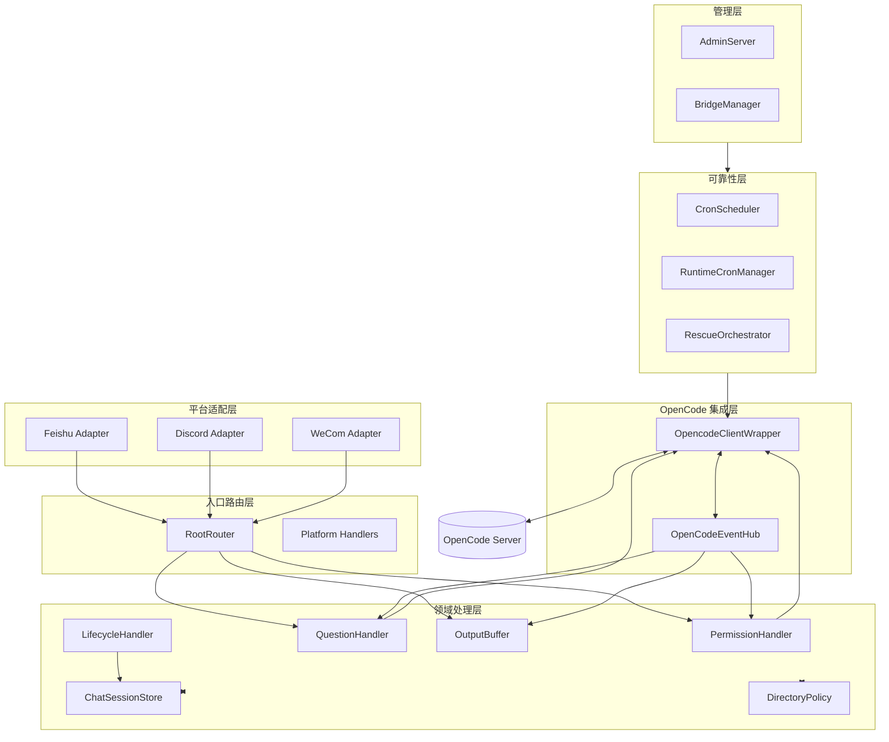

# OpenCode Bridge 架构（v2.9.5-beta）

本文档描述当前版本的真实运行架构，重点说明平台接入、路由调度、事件闭环、目录一致性和可运维策略。

## 1. 架构目标

- 在飞书、Discord 和企业微信三端提供一致的任务闭环能力（消息、权限、提问、流式输出、回滚）。
- 保持平台能力边界，不强行复用不适配的交互范式。
- 保证会话与目录的一致性，降低"日志显示成功但任务未继续"的风险。
- 用分层结构替代入口堆逻辑，支持后续平台扩展与灰度演进。

## 2. 分层模型

## 3. 核心模块职责

### 3.1 平台适配层

- `src/platform/adapters/feishu-adapter.ts`：接收飞书事件并转换为统一事件模型。
- `src/platform/adapters/discord-adapter.ts`：接收 Discord 网关消息和组件交互。
- `src/platform/adapters/wecom-adapter.ts`：接收企业微信事件并转换为统一事件模型。

### 3.2 入口路由层

- `src/router/root-router.ts`：多平台消息与卡片动作统一入口。
- `src/handlers/`：各平台处理器，负责命令解析、面板、文本权限/问题处理与消息收发编排。
- `src/router/action-handlers.ts`：从入口剥离权限/问题动作回调，降低耦合。

### 3.3 领域处理层

- `src/permissions/handler.ts`：权限请求队列、白名单判定、出队与超时清理。
- `src/opencode/question-handler.ts`：问题状态管理（多题推进、跳过、提交）。
- `src/opencode/output-buffer.ts`：流式片段聚合、节流触发、状态标记。
- `src/store/chat-session.ts`：`platform:conversationId` 命名空间映射与会话别名。
- `src/utils/directory-policy.ts`：目录安全策略、白名单约束、Git 根归一化。
- `src/handlers/lifecycle.ts`：生命周期扫描、清理与解散逻辑。

### 3.4 OpenCode 集成层

- `src/opencode/client.ts`：会话/消息/命令/权限/问题统一封装。
- `src/router/opencode-event-hub.ts`：OpenCode 事件单入口，分发到权限、提问、输出。

### 3.5 可靠性层

- `src/reliability/scheduler.ts`：Cron 调度器，管理定时任务。
- `src/reliability/runtime-cron.ts`：运行时 Cron 管理器，支持动态创建和管理任务。
- `src/reliability/rescue-executor.ts`：宕机救援执行器，自动修复本地 OpenCode。
- `src/reliability/conversation-heartbeat.ts`：会话心跳引擎，保持会话活跃。

### 3.6 管理层

- `src/admin/admin-server.ts`：Web 配置中心服务器，提供 REST API 和静态文件服务。
- `src/admin/bridge-manager.ts`：桥接服务管理器，控制服务生命周期。

## 4. 关键链路

### 4.1 消息链路（入站 -> OpenCode）

1. 平台适配器收到消息并归一化。
2. RootRouter 完成命令解析与会话定位。
3. 根据会话配置拼装模型、角色、强度、目录参数。
4. 调用 `opencodeClient.sendMessage*` 进入 OpenCode。

### 4.2 事件链路（OpenCode -> 出站）

1. `opencodeClient` 监听事件流。
2. `OpenCodeEventHub` 处理 `messagePartUpdated/sessionStatus/...`。
3. Timeline 与 OutputBuffer 聚合并节流。
4. 飞书走卡片流，Discord 走文本/组件更新，企业微信走文本更新。

### 4.3 权限闭环链路

1. 收到 `permission.asked` 后先判定白名单。
2. 命中白名单时自动允许；若失败，降级入队等待人工确认。
3. 人工确认支持卡片动作和文本兜底两条路径。
4. 权限回传支持目录感知与候选目录回退，减少目录切换后的假死。

### 4.4 可靠性链路

1. CronScheduler 按配置调度定时任务。
2. RuntimeCronManager 管理运行时创建的 Cron 任务。
3. RescueOrchestrator 监控 OpenCode 状态，连续失败达到阈值后触发救援。
4. 会话心跳引擎保持会话活跃，防止超时。

## 5. 目录一致性策略

- 会话创建/切换统一经过目录策略校验。
- `create_chat` 工作目录来源按三类合并：
  - `DEFAULT_WORK_DIRECTORY`
  - `ALLOWED_DIRECTORIES`
  - 已存在会话目录（历史/绑定）
- 权限回传带目录候选信息，优先命中当前会话目录，再回退到候选目录列表。

## 6. 平台边界原则

- 飞书、Discord 和企业微信是独立平台：
  - 不跨平台借调 UI 组件。
  - 不跨平台复用会话展示语义。
- 共性逻辑下沉到领域层（权限、问题、会话映射、目录策略）。
- 平台差异留在入口层和适配层（卡片/组件/文本交互）。

## 7. 配置存储架构

- `.env` 文件：仅存储 Admin 面板启动参数（`ADMIN_PORT`、`ADMIN_PASSWORD`）。
- SQLite 数据库：存储所有业务配置，支持实时读写。
- 配置迁移：首次启动时自动从 `.env` 迁移至 SQLite，原 `.env` 备份为 `.env.backup`。

## 8. 运行与排障建议

- 先看路由模式和平台启用日志，再看会话映射与权限队列状态。
- 权限问题优先核查：队列 key、session 绑定、目录候选是否正确。
- 卡片问题优先核查：路由动作是否进入对应 handler，是否被平台能力限制。
- 可靠性问题优先核查：Cron 任务状态、心跳配置、救援策略。
- 修改核心链路后必须跑：`npm run build` + `npm test`。

## 9. 未来扩展点

- 增加新的平台适配器（只需接入统一事件模型和 sender 接口）。
- 将更多跨平台能力收敛到 action-handlers 与 event-hub。
- 继续增强目录实例自愈能力与权限重试可观测性。
- 扩展可靠性层，支持更多救援策略和监控指标。
