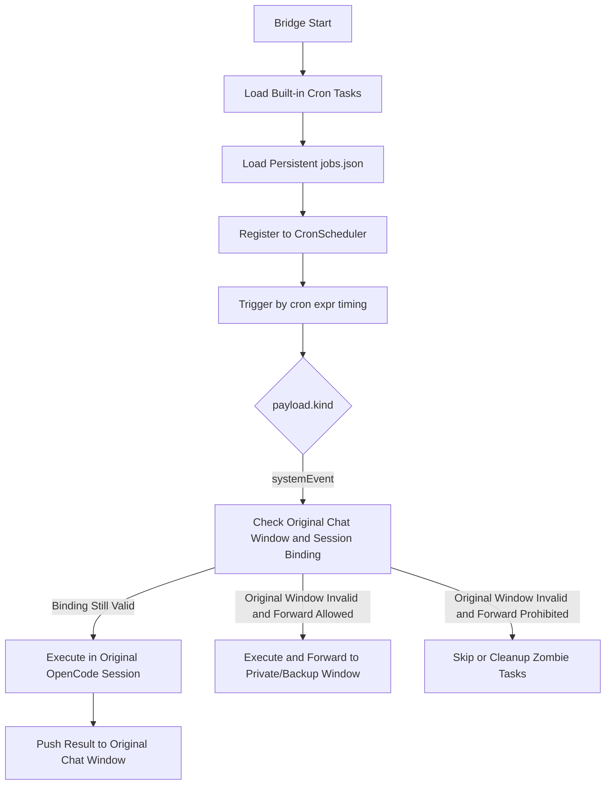
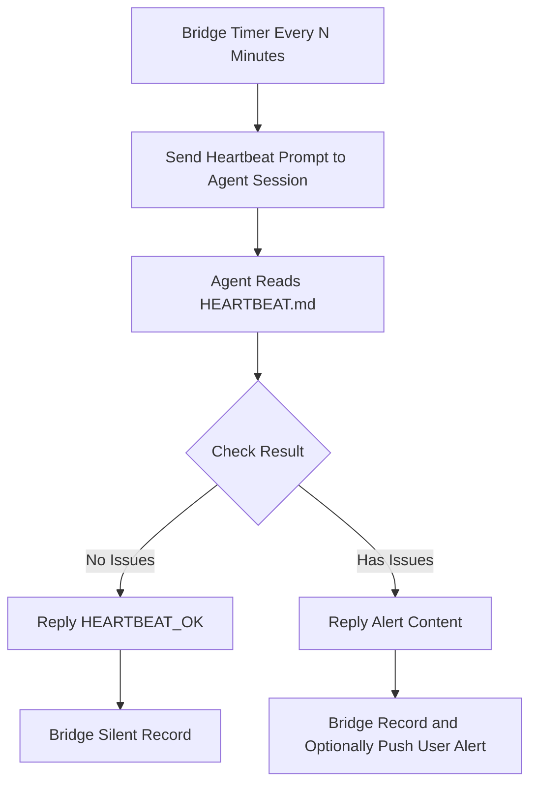

# Reliability Guide (Heartbeat + Cron + Crash Rescue)

## 1) Default Behavior

- Starting the bridge service automatically initializes the reliability lifecycle (heartbeat engine + Cron scheduling + rescue orchestration).
- Proactive heartbeat is disabled by default (`RELIABILITY_PROACTIVE_HEARTBEAT_ENABLED=false`); when enabled, triggered by Bridge timer, independent of Feishu inbound messages.
- Built-in Cron tasks are enabled by default:
  - `watchdog-probe`: Every 30 seconds
  - `process-consistency-check`: Every 60 seconds
  - `stale-cleanup`: Every 5 minutes (placeholder in current version)
  - `budget-reset`: Daily at 0:00

## 2) Runtime Cron Dynamic Management

### Three Entry Points

Currently provides three entry points, sharing the same `RuntimeCronManager` and persistence file:

- **HTTP API**: `/cron/list|add|update|remove`
- **Feishu**: `/cron ...`
- **Discord**: `///cron ...`

### Default Behavior

Cron tasks bind to "the chat window that created it + the OpenCode session bound at that time". When triggered, execution prioritizes the original session, and results are pushed back to the original chat window.

### Natural Language Semantic Parsing

Both `/cron` and `///cron` support natural language semantic parsing, for example:

- `/cron add a scheduled task, send me an AI briefing at 8am every morning`
- `///cron produce AI briefing, remember to send on weekdays`
- `/cron pause task <jobId>`

### API Endpoints

Dynamic CRUD via local HTTP API:

- `GET /cron/list`: List tasks
- `POST /cron/add`: Add task
- `POST /cron/update`: Update task
- `POST /cron/remove`: Remove task

Tasks are persisted to `RELIABILITY_CRON_JOBS_FILE` (default `~/cron/jobs.json`) and automatically restored after service restart. If the current chat has no bound OpenCode session, `/cron add ...` will reject creation to avoid degradation into anonymous session execution.

### Task List Example

`/cron list` additionally displays target window, orphan status, and candidate fallback targets:

```text
🕒 Runtime Cron Task List
(Status based on local binding table; fallback is candidate target)
- [Enabled] 7c0d... | International News Briefing | 0 0 18 * * *
  text: Send me today's international news
  target: feishu:oc_xxx (local binding valid) | session: ses_xxx
  orphan: No
  fallback: Candidate feishu:oc_private_xxx (creator private chat)

- [Enabled] a19f... | Yesterday Summary | 0 0 9 * * 1-5
  text: Remember to send me yesterday summary when we first communicate daily
  target: feishu:oc_group_yyy (original session migrated to feishu:oc_group_zzz) | session: ses_yyy
  orphan: Yes (original session migrated to another window)
  fallback: Candidate feishu:oc_private_xxx (creator private chat); original session migrated, runtime won't directly fallback
```

### API Call Examples

```bash
# List tasks
curl http://127.0.0.1:4097/cron/list

# Add task (trigger systemEvent every minute)
curl -X POST http://127.0.0.1:4097/cron/add \
  -H "Content-Type: application/json" \
  -d '{
    "name": "daily-check",
    "schedule": { "kind": "cron", "expr": "0 * * * * *" },
    "payload": {
      "kind": "systemEvent",
      "text": "Perform routine check",
      "sessionId": "ses_xxx",
      "delivery": {
        "platform": "feishu",
        "conversationId": "oc_xxx"
      }
    },
    "enabled": true
  }'

# Update task (disable)
curl -X POST http://127.0.0.1:4097/cron/update \
  -H "Content-Type: application/json" \
  -d '{
    "id": "<job-id>",
    "enabled": false
  }'

# Remove task
curl -X POST http://127.0.0.1:4097/cron/remove \
  -H "Content-Type: application/json" \
  -d '{ "id": "<job-id>" }'
```

If `RELIABILITY_CRON_API_TOKEN` is configured, requests must include:

```bash
-H "Authorization: Bearer <token>"
```

## 3) Minimal Usable Configuration

```dotenv
# Recommended to keep local OpenCode to enable auto-rescue
OPENCODE_HOST=localhost
OPENCODE_PORT=4096

# Cron basic switches
RELIABILITY_CRON_ENABLED=true
RELIABILITY_CRON_API_ENABLED=true
RELIABILITY_CRON_API_HOST=127.0.0.1
RELIABILITY_CRON_API_PORT=4097
# RELIABILITY_CRON_API_TOKEN=your-token
# RELIABILITY_CRON_JOBS_FILE=/absolute/path/jobs.json
# RELIABILITY_CRON_ORPHAN_AUTO_CLEANUP=false
# RELIABILITY_CRON_FORWARD_TO_PRIVATE=false
# RELIABILITY_CRON_FALLBACK_FEISHU_CHAT_ID=oc_xxx
# RELIABILITY_CRON_FALLBACK_DISCORD_CONVERSATION_ID=1234567890

# Proactive heartbeat switches (disabled by default)
RELIABILITY_PROACTIVE_HEARTBEAT_ENABLED=false
RELIABILITY_INBOUND_HEARTBEAT_ENABLED=false

# Reliability strategy (already effective by default, here's explicit syntax)
RELIABILITY_LOOPBACK_ONLY=true
RELIABILITY_HEARTBEAT_INTERVAL_MS=1800000
RELIABILITY_FAILURE_THRESHOLD=3
RELIABILITY_WINDOW_MS=90000
RELIABILITY_COOLDOWN_MS=300000
RELIABILITY_REPAIR_BUDGET=3

# Heartbeat Agent and prompt (optional)
# RELIABILITY_HEARTBEAT_AGENT=companion
# RELIABILITY_HEARTBEAT_PROMPT=Read HEARTBEAT.md ... reply HEARTBEAT_OK

# Heartbeat alert push to Feishu chat_id (comma-separated, optional)
# RELIABILITY_HEARTBEAT_ALERT_CHATS=oc_xxx,oc_yyy

# Crash rescue will read and backup this config file
OPENCODE_CONFIG_FILE=./opencode.json
```

## 4) How to Use Heartbeat

0. To enable proactive heartbeat, first set `RELIABILITY_PROACTIVE_HEARTBEAT_ENABLED=true` and restart service.
1. Open `HEARTBEAT.md`, edit check items following these rules:
   - `- [ ] failure_type: description` = Enabled
   - `- [x] failure_type: description` = Disabled
2. Bridge timer triggers proactive heartbeat prompt to Agent Session at `RELIABILITY_HEARTBEAT_INTERVAL_MS` interval.
3. Agent reads `HEARTBEAT.md` and performs checks:
   - No issues: Reply `HEARTBEAT_OK`
   - Has issues: Return alert text (can be pushed by bridge to `RELIABILITY_HEARTBEAT_ALERT_CHATS`)
4. Check `memory/heartbeat-session.json` (heartbeat session) and `logs/reliability-audit.jsonl` (audit).

## 5) Execution Flow

### 5.1 Cron Execution Flow



### 5.2 Heartbeat Execution Flow



## 6) Auto-Rescue Trigger Conditions

Current runtime link uses "infinite reconnection threshold" judgment:

- Health probe continuous failures, meeting:
  - Consecutive failure count `>= RELIABILITY_FAILURE_THRESHOLD`
  - Failure window duration `>= RELIABILITY_WINDOW_MS`
- And meeting the following guards:
  - Target host is loopback (`localhost/127.0.0.1/::1`)
  - Repair budget not exhausted
  - Cooldown window passed since last repair

When triggered, executes: lock acquisition and single instance check → environment diagnosis → config backup and two-level fallback → start OpenCode → health re-check → auto dispatch repair context.

## 7) Artifacts and Audit Locations

- Heartbeat session status: `memory/heartbeat-session.json`
- Reliability audit: `logs/reliability-audit.jsonl`
- Config backup: `<OPENCODE_CONFIG_FILE>.bak.<timestamp>.<sha256>`
- Recovery notification: Automatically sent to OpenCode session, message contains `failureReason`, `backupPath`, `nextAction`

## 8) Zombie Cron and Fallback Strategy

- `RELIABILITY_CRON_ORPHAN_AUTO_CLEANUP=false`:
  - Does not auto-scan Cron orphan tasks on startup.
  - Does not auto-delete corresponding Cron on Feishu group dismiss / Discord channel delete.
  - Tasks skip and log when binding is invalid during execution.

- `RELIABILITY_CRON_ORPHAN_AUTO_CLEANUP=true`:
  - Scans and deletes zombie Cron with missing original window binding or original session on startup.
  - Feishu group dismiss, Discord channel delete联动 deletes Cron bound to that window.
  - `stale-cleanup` periodic task continues to scan zombie Cron.

- `RELIABILITY_CRON_FORWARD_TO_PRIVATE=true`:
  - When original chat window is invalid but original session is still executable and not bound to another active window, can forward results to private/backup window.
  - Backup target priority: task explicit fallback > env fallback id > same platform creator private chat.

## 9) Common Self-Check Commands

```bash
# 1) Check OpenCode local environment
node scripts/deploy.mjs opencode-check

# 2) Verify reliability bootstrap/cleanup link
npm test -- tests/reliability-bootstrap.test.ts

# 3) Verify rescue end-to-end scenarios
npm test -- tests/reliability-rescue.e2e.test.ts
```

**Supplement**: `RELIABILITY_MODE` is currently a reserved policy field; current version still uses "threshold + budget + cooldown + loopback restriction" as actual trigger conditions.
