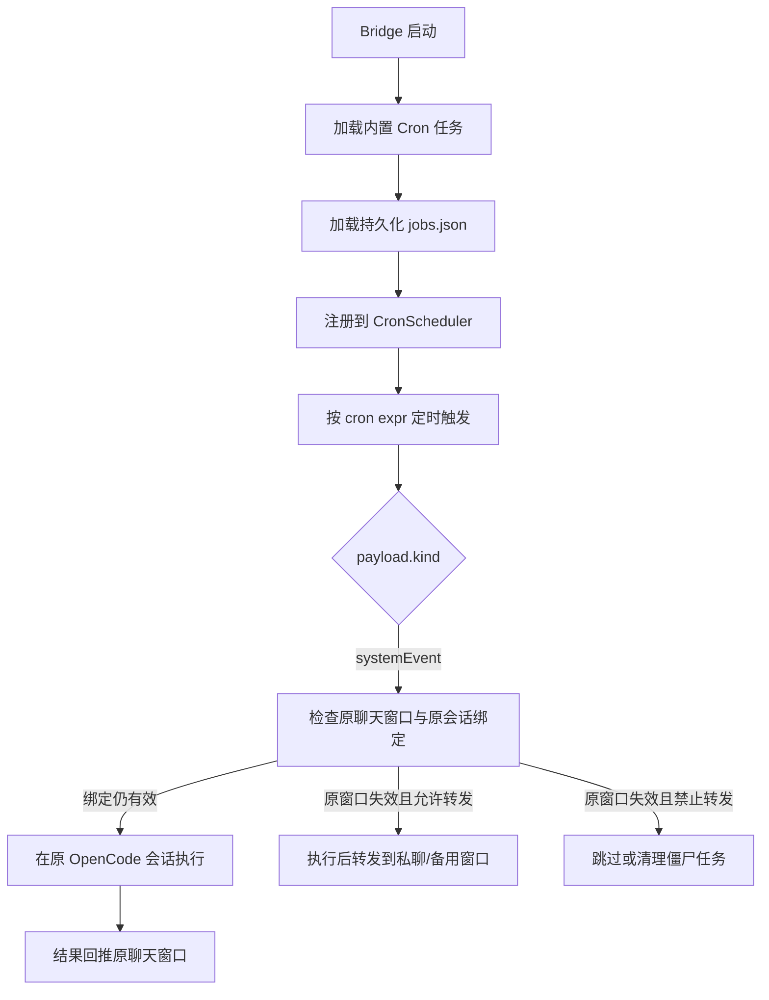
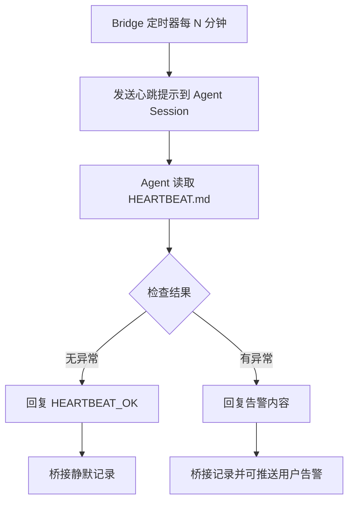

# 可靠性能力（心跳 + Cron + 宕机救援）

## 1) 默认行为

- 启动桥接服务后会自动初始化可靠性生命周期（心跳引擎 + Cron 调度 + 救援编排）。
- 默认情况下主动心跳关闭（`RELIABILITY_PROACTIVE_HEARTBEAT_ENABLED=false`）；若开启后由 Bridge 定时器触发，不依赖飞书入站消息。
- 内置 Cron 任务默认启用：
  - `watchdog-probe`: 每 30 秒
  - `process-consistency-check`: 每 60 秒
  - `stale-cleanup`: 每 5 分钟（当前版本为调度占位）
  - `budget-reset`: 每天 0 点

## 2) Cron 运行时动态管理

### 三种入口

当前提供三种入口，底层共用同一 `RuntimeCronManager` 与同一持久化文件：

- **HTTP API**：`/cron/list|add|update|remove`
- **Feishu**：`/cron ...`
- **Discord**：`///cron ...`

### 默认行为

Cron 任务会绑定"创建它的聊天窗口 + 当时绑定的 OpenCode 会话"，到点后优先在原会话执行，并把结果回推到原聊天窗口。

### 自然语言语义解析

同时支持 `/cron` 与 `///cron` 的自然语言语义解析，例如：

- `/cron 添加个定时任务，每天早上 8 点向我发送一份 AI 简报`
- `///cron 生产 AI 简报，工作日记得发我`
- `/cron 暂停任务 <jobId>`

### API 端点

通过本地 HTTP API 动态增删改查：

- `GET /cron/list`：列出任务
- `POST /cron/add`：新增任务
- `POST /cron/update`：更新任务
- `POST /cron/remove`：删除任务

任务持久化到 `RELIABILITY_CRON_JOBS_FILE`（默认 `~/cron/jobs.json`），服务重启后自动恢复。若当前聊天没有绑定 OpenCode 会话，则 `/cron add ...` 会拒绝创建，避免后续退化成新开匿名会话执行。

### 任务列表示例

`/cron list` 现在会额外展示目标窗口、孤儿状态和候选回退目标：

```text
🕒 运行时 Cron 任务列表
（状态基于本地绑定表；fallback 为候选目标）
- [启用] 7c0d... | 国际新闻简报 | 0 0 18 * * *
  text: 给我推送今天的国际新闻
  target: feishu:oc_xxx（本地绑定有效） | session: ses_xxx
  orphan: 否
  fallback: 候选 feishu:oc_private_xxx（创建者私聊）

- [启用] a19f... | 昨日总结 | 0 0 9 * * 1-5
  text: 当我们每天第一次沟通，记得给我发昨日总结
  target: feishu:oc_group_yyy（原会话已迁移到 feishu:oc_group_zzz） | session: ses_yyy
  orphan: 是（原会话已迁移到其他窗口）
  fallback: 候选 feishu:oc_private_xxx（创建者私聊）；原会话已迁移，运行时不会直接回退
```

### API 调用示例

```bash
# 列出任务
curl http://127.0.0.1:4097/cron/list

# 新增任务（每分钟触发 systemEvent）
curl -X POST http://127.0.0.1:4097/cron/add \
  -H "Content-Type: application/json" \
  -d '{
    "name": "daily-check",
    "schedule": { "kind": "cron", "expr": "0 * * * * *" },
    "payload": {
      "kind": "systemEvent",
      "text": "执行例行检查",
      "sessionId": "ses_xxx",
      "delivery": {
        "platform": "feishu",
        "conversationId": "oc_xxx"
      }
    },
    "enabled": true
  }'

# 更新任务（禁用）
curl -X POST http://127.0.0.1:4097/cron/update \
  -H "Content-Type: application/json" \
  -d '{
    "id": "<job-id>",
    "enabled": false
  }'

# 删除任务
curl -X POST http://127.0.0.1:4097/cron/remove \
  -H "Content-Type: application/json" \
  -d '{ "id": "<job-id>" }'
```

如果配置了 `RELIABILITY_CRON_API_TOKEN`，请求需携带：

```bash
-H "Authorization: Bearer <token>"
```

## 3) 最小可用配置

```dotenv
# 建议保持本地 OpenCode，才能触发自动救援
OPENCODE_HOST=localhost
OPENCODE_PORT=4096

# Cron 基础开关
RELIABILITY_CRON_ENABLED=true
RELIABILITY_CRON_API_ENABLED=true
RELIABILITY_CRON_API_HOST=127.0.0.1
RELIABILITY_CRON_API_PORT=4097
# RELIABILITY_CRON_API_TOKEN=your-token
# RELIABILITY_CRON_JOBS_FILE=/absolute/path/jobs.json
# RELIABILITY_CRON_ORPHAN_AUTO_CLEANUP=false
# RELIABILITY_CRON_FORWARD_TO_PRIVATE=false
# RELIABILITY_CRON_FALLBACK_FEISHU_CHAT_ID=oc_xxx
# RELIABILITY_CRON_FALLBACK_DISCORD_CONVERSATION_ID=1234567890

# 主动心跳开关（默认关闭）
RELIABILITY_PROACTIVE_HEARTBEAT_ENABLED=false
RELIABILITY_INBOUND_HEARTBEAT_ENABLED=false

# 可靠性策略（默认即已生效，这里是显式写法）
RELIABILITY_LOOPBACK_ONLY=true
RELIABILITY_HEARTBEAT_INTERVAL_MS=1800000
RELIABILITY_FAILURE_THRESHOLD=3
RELIABILITY_WINDOW_MS=90000
RELIABILITY_COOLDOWN_MS=300000
RELIABILITY_REPAIR_BUDGET=3

# 心跳 Agent 与提示词（可选）
# RELIABILITY_HEARTBEAT_AGENT=companion
# RELIABILITY_HEARTBEAT_PROMPT=Read HEARTBEAT.md ... reply HEARTBEAT_OK

# 心跳异常时推送到飞书 chat_id（逗号分隔，可选）
# RELIABILITY_HEARTBEAT_ALERT_CHATS=oc_xxx,oc_yyy

# 宕机救援会读取并备份这个配置文件
OPENCODE_CONFIG_FILE=./opencode.json
```

## 4) 心跳怎么用

0. 若要启用主动心跳，先设置 `RELIABILITY_PROACTIVE_HEARTBEAT_ENABLED=true` 并重启服务。
1. 打开 `HEARTBEAT.md`，按以下规则编辑检查项：
   - `- [ ] failure_type: 描述` = 启用
   - `- [x] failure_type: 描述` = 停用
2. Bridge 定时器按 `RELIABILITY_HEARTBEAT_INTERVAL_MS` 触发，主动向 Agent Session 发送心跳提示。
3. Agent 读取 `HEARTBEAT.md` 并执行检查：
   - 无异常：回复 `HEARTBEAT_OK`
   - 有异常：返回告警文本（可由桥接推送到 `RELIABILITY_HEARTBEAT_ALERT_CHATS`）
4. 查看 `memory/heartbeat-session.json`（心跳 session）与 `logs/reliability-audit.jsonl`（审计）。

## 5) 执行流程

### 5.1 Cron 执行流程



### 5.2 心跳执行流程



## 6) 自动救援触发条件

当前运行链路按"无限重连阈值"判定：

- 健康探针持续失败，且满足：
  - 连续失败次数 `>= RELIABILITY_FAILURE_THRESHOLD`
  - 失败窗口时长 `>= RELIABILITY_WINDOW_MS`
- 同时满足以下守卫：
  - 目标主机为 loopback（`localhost/127.0.0.1/::1`）
  - 修复预算未耗尽
  - 距离上次修复已过冷却窗口

命中后会执行：加锁与单实例检查 → 环境诊断 → 配置备份与两级回退 → 启动 OpenCode → 健康复检 → 自动下发修复上下文。

## 7) 产物与审计位置

- 心跳 session 状态：`memory/heartbeat-session.json`
- 可靠性审计：`logs/reliability-audit.jsonl`
- 配置备份：`<OPENCODE_CONFIG_FILE>.bak.<timestamp>.<sha256>`
- 恢复通知：自动发送到 OpenCode 会话，消息内包含 `failureReason`、`backupPath`、`nextAction`

## 8) 僵尸 Cron 与回退策略

- `RELIABILITY_CRON_ORPHAN_AUTO_CLEANUP=false`：
  - 不在启动时自动扫描 Cron 孤儿任务。
  - 不在飞书群解散 / Discord 频道删除时自动删除对应 Cron。
  - 任务执行时若绑定失效，会直接跳过并记录日志。

- `RELIABILITY_CRON_ORPHAN_AUTO_CLEANUP=true`：
  - 启动时扫描并删除缺少原窗口绑定或缺少原 session 的僵尸 Cron。
  - 飞书群解散、Discord 频道删除时，联动删除绑定到该窗口的 Cron。
  - `stale-cleanup` 周期任务也会继续扫描僵尸 Cron。

- `RELIABILITY_CRON_FORWARD_TO_PRIVATE=true`：
  - 当原聊天窗口失效、但原 session 仍可执行且未绑定到别的活动窗口时，可把结果转发到私聊/备用窗口。
  - 备用目标优先级：任务显式 fallback > env fallback id > 同平台创建者私聊。

## 9) 常用自检命令

```bash
# 1) 检查 OpenCode 本地环境
node scripts/deploy.mjs opencode-check

# 2) 核验可靠性启动/清理链路
npm test -- tests/reliability-bootstrap.test.ts

# 3) 核验救援端到端场景
npm test -- tests/reliability-rescue.e2e.test.ts
```

**补充**：`RELIABILITY_MODE` 目前是预留策略字段，当前版本仍以"阈值 + 预算 + 冷却 + loopback 限制"作为实际触发条件。
